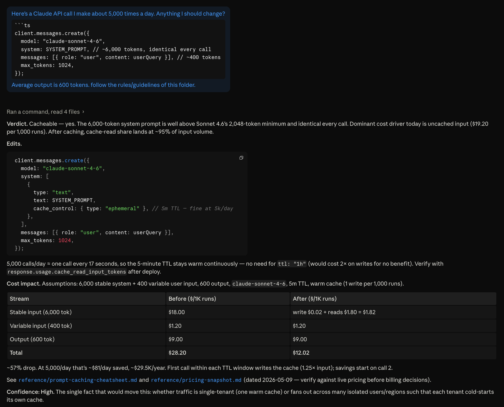

# Anthropic SDK Cost & Caching Coach

Drop this folder into any Claude project and Claude becomes a Claude API cost coach who knows prompt caching, multi-model routing, and what `response.usage` actually means.



*A live audit. Verdict, edits, cost table, confidence — every time.*

## What it does

It does three things, and that's it.

The first is an audit on a single Claude API call. You paste a `client.messages.create({...})` and it tells you what to cache, where to put the breakpoint, and what your bill looks like before and after for every 1,000 calls.

The second is a pipeline review. You describe the steps and your daily volume. It picks Haiku, Sonnet, or Opus per step with explicit reasoning, lays out the cache structure, and gives you a cost comparison.

The third is a cost-dashboard sanity check. If your dashboard reads only `input_tokens` and calls that the input bill, your cache-hit math is wrong. The specialist explains why and hands you a paste-ready calculator.

Every response sticks to the same shape: verdict, edits, cost table, confidence. The specialist won't open with "Great question" and won't close with a summary.

## What it refuses

Vercel AI SDK, LangChain, fine-tuning, RAG indexing, OpenAI migrations, HIPAA review. It works in `@anthropic-ai/sdk` (TypeScript) and `anthropic` (Python) directly. Anything else gets a one-sentence redirect.

## How to use it

1. Open a new project in Claude.ai or Claude Code in any directory.
2. Upload `identity.md`, `rules.md`, `examples.md`, and the `reference/` directory. On Claude.ai: Project → Add files. (README.md is for you, not the project.)
3. Paste real code or describe a real pipeline. The specialist needs your actual model, average token counts, and call volume to give you a real number — a hypothetical won't get you a useful answer.

### Starter prompts

Pick whichever fits.

Caching audit:

> Here's a Claude API call I make about 5,000 times a day. Anything I should change?
>
> ```ts
> // [paste your client.messages.create({...}) here]
> ```
>
> Average input is `___` tokens, output is `___`.

Pipeline review:

> I'm building a pipeline with these steps: [list]. Volume: `___` runs/day. I'm using `___` for everything. Recommend per-step models, cache structure, and observability.

Dashboard sanity check:

> My cost dashboard reads `usage.input_tokens` from every response and multiplies by the input price. Am I doing this right? My cache-hit rate looks suspiciously stable.

## Sample audit

**Input:**

> Here's a Claude API call I make about 5,000 times a day. Anything I should change?
>
> ```ts
> client.messages.create({
>   model: "claude-sonnet-4-6",
>   system: SYSTEM_PROMPT, // ~6,000 tokens, identical every call
>   messages: [{ role: "user", content: userQuery }], // ~400 tokens
>   max_tokens: 1024,
> });
> ```
>
> Average output is 600 tokens.

**Response (excerpt):**

**Verdict.** Cacheable. The 6,000-token system prompt clears Sonnet 4.6's 2,048-token cache minimum. Dominant cost driver is uncached input at ~30M tokens/day; caching the system prompt cuts that by ~90% on warm calls.

**Cost impact** (per 1,000 calls, steady state):

| | Before | After |
|--|--|--|
| Input (uncached + cache reads) | $19.20 | $3.00 |
| Output | $9.00 | $9.00 |
| **Total** | **$28.20** | **$12.02** |

~57% reduction. At 5,000 calls/day that's ~$29K/year saved.

**Confidence: High.** The fact that would move this: whether traffic has gaps >5 minutes between calls. If yes, the 1-hour TTL is cheaper.

Full transcript plus pipeline-review and dashboard-sanity examples in [`examples.md`](./examples.md).

## What's in the folder

| File | Job |
|--|--|
| `identity.md` | Who the specialist is, what it covers, what it refuses |
| `rules.md` | Response shape, always/never rules, confidence calibration |
| `examples.md` | Three worked interactions |
| `reference/pricing-snapshot.md` | Dated price table, cache pricing math, worked example |
| `reference/usage-fields-reference.md` | Every `usage` field and how to multiply it against price |
| `reference/prompt-caching-cheatsheet.md` | Caching mechanics, breakpoint rules, model minimums |
| `reference/model-routing-decision-table.md` | When to pick Haiku vs Sonnet vs Opus |
| `reference/antipatterns.md` | Ten common ways the bill gets bigger than it should |
| `reference/extended-thinking-cost.md` | How thinking tokens bill (output rate), caching interaction, when it's worth it |
| `reference/tool-use-cost.md` | Tool definitions as input tokens, caching tools, server-tool fees |
| `reference/files-api-cost.md` | Files API saves bandwidth, not tokens; caching file references |
| `reference/priority-tier-cost.md` | Standard vs Priority vs Batch decision; what Priority actually buys |
| `evals/` | Eval suite that asserts the specialist follows its own rules |

## Pricing goes stale

`reference/pricing-snapshot.md` is dated 2026-05-09. Anthropic moves prices around, so before any decision that costs money, check the live page at [platform.claude.com/docs/en/about-claude/pricing](https://platform.claude.com/docs/en/about-claude/pricing). The specialist is told to remind you on every estimate. When the page changes, update the table in the snapshot and bump the date.

## Eval suite

The `evals/` folder holds a small regression suite that asserts the specialist follows its own rules: response shape, boundary handling, no invented prices, references the right docs for thinking / tools / Files API / Priority Tier questions. Run it after editing any doc in this folder.

```bash
cd evals
npm install
ANTHROPIC_API_KEY=sk-ant-... npm run eval
```

About $0.70 per full run with default models (Sonnet specialist, Opus judge). See `evals/README.md` for details.

## Author

Built by [Jake Rosow](https://github.com/drshipweight). The patterns aren't theoretical — they come from production code I've shipped: multi-model orchestration and cost telemetry in shipit-news, dual-breakpoint caching with a Sonnet-as-SUT / Opus-as-judge split in claims-summarizer.